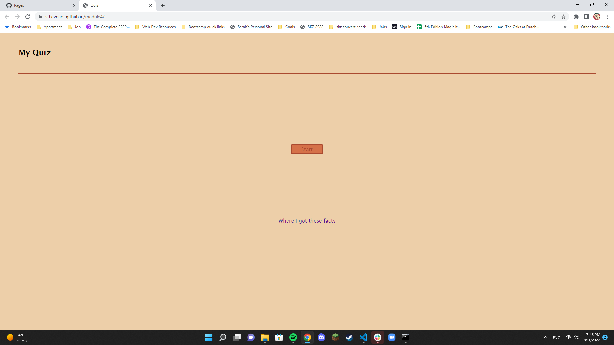
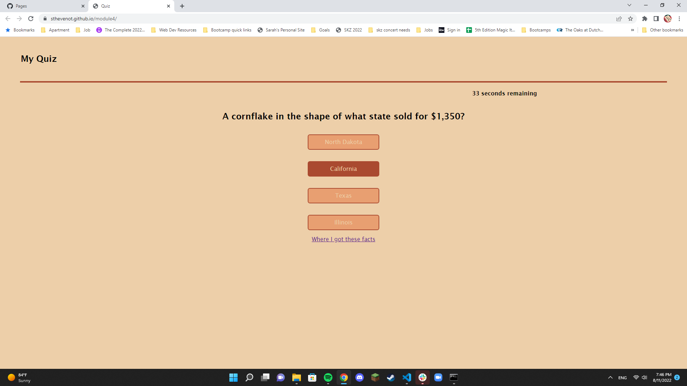
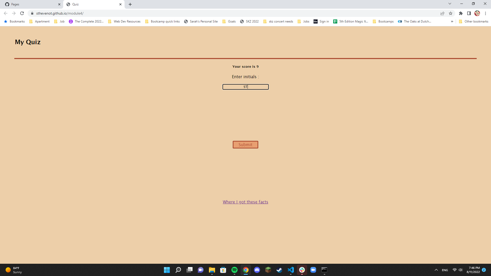
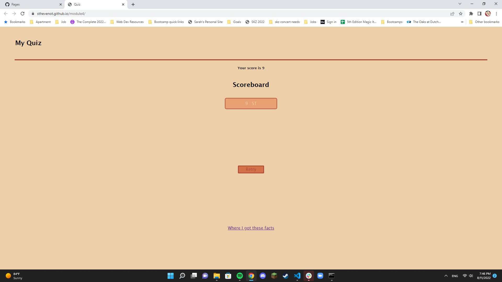

# module4
This module had the focus of creating a functional quiz. The quiz had to have a start button that initiated the quiz when clicked and trigger a countdown. Each question answered should allow the user to move on to the next question, if answered wrong it should take time away from the countdown. At the end it displays the score as the time that was left on the countdown and you are able to save your initials. This should save the score and initials locally so that you can see them next time you choose to take the quiz.

